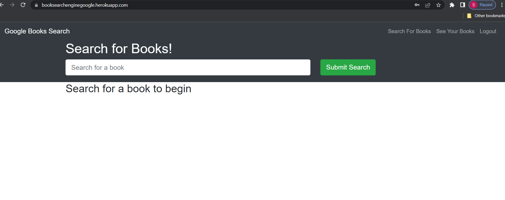
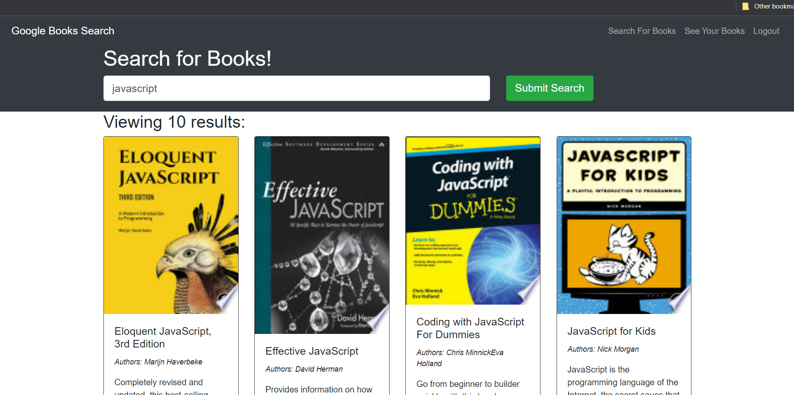
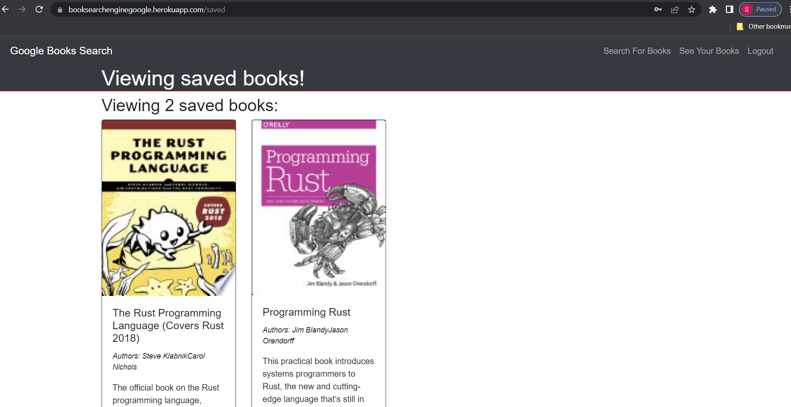

# Google Book Search Engine

## Table of Contents 
  * [User Story](#user-story)
  * [Acceptance Criteria](#acceptance-criteria)
  * [Mock Up](#mock-up)
  * [License](#license)
  * [Credits](#Credits)
  * [Deployed Link](#deployed-link)

## User Story

As user who loves to read wants to search for new books to purchase.  The Google Book Search Engine allows them to search and save book they may want to purchase in the future.

## Accpetance Criteria

When a user goes to the site they type in a topic and a list of books will populate.  In order to save books, the user will sign up and then login to the sight.  Once logged in, a Save This Book button will appear.  The User can click on the save this book button and come back later, log in and open see your books.   Likwise, while looking at their saved books, there will be a Delete This Book to remove a selection.   

## Mock-Up

You will be able view several images showing the search and save functionality of the website.  

The following web application's appearance and functionality:

## License 
A short, permissive software license. Basically, you can do whatever you want as long as you include the original copyright and license notice in any copy of the software/source.  There are many variations of this license in use.

## Credits

Connect MongoDB & Heroku:  https://medium.com/nerd-for-tech/get-started-with-mongodb-atlas-dbb734726a7f
                           https://www.fosslinux.com/50303/deploy-mongodb-on-heroku.htm

## Deployed Link

* Website URL: https://booksearchenginegoogle.herokuapp.com/
* GitHub repository URL: https://github.com/MicheleTornetta/booksearchengine